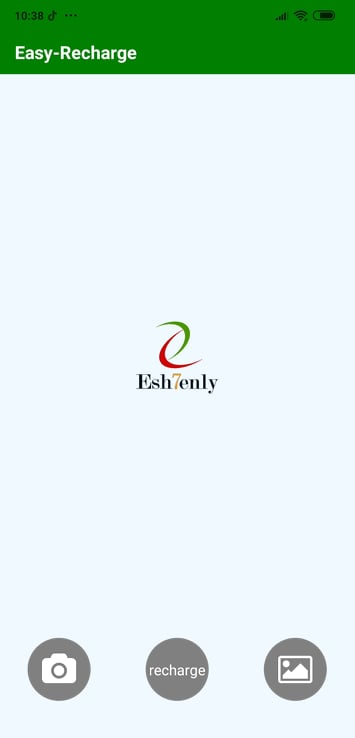
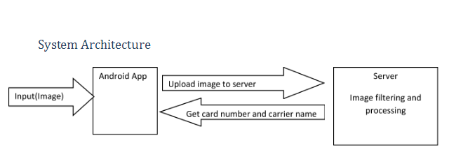
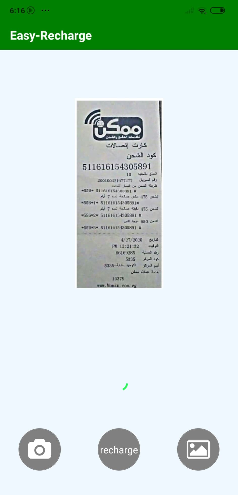
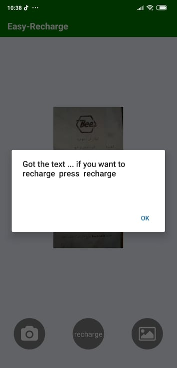
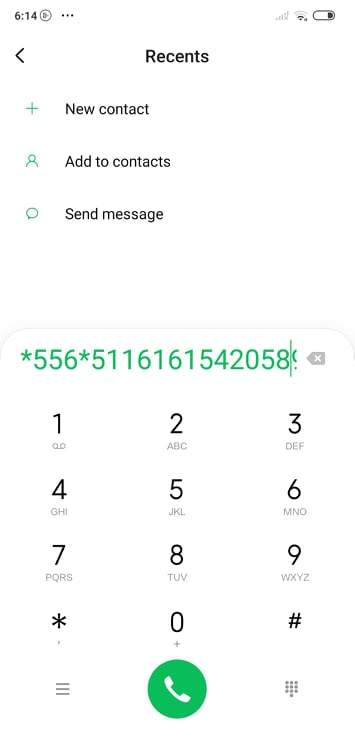
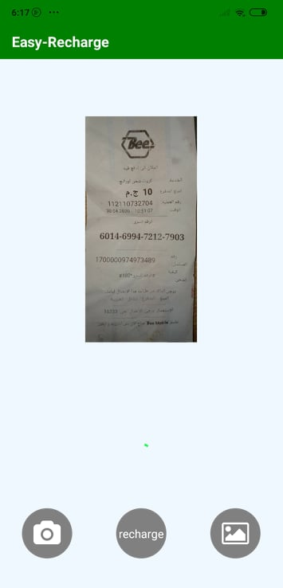
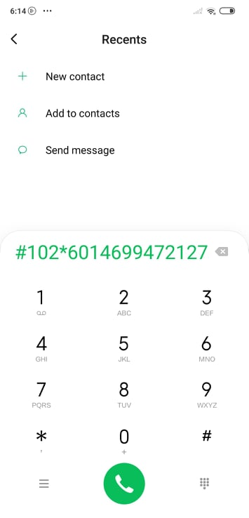

# Contributions
1. image processing contributions are in  image processing branch , and the master branch conatin the final version only , but we faced  a problem that image processing folder  was deleted suddenly in the master so we uploaded it again with its photos and test cases in the Easy Recharge React version folder.

2. contributions of all team members appear in branches

# Easy-Recharge

Easy Recharge is an android application that allow users to take photo of scratch card to recharge it automatically 
there are 2 versions from the application 

1. react application that upload the image to server with python code that uses openCV and tesseract (finished)
2. kotlin application that use firebase library and Ml vision(all steps are done locally) (missing some features)

# contributions of all team members appear in branches

# Features 

- Capture from camera or upload image from gallery and recharge automatically 
- Support different types of cards 
- Recharge codes automatically according to the service provider company
- Provide optimized , fast mobile android application
- Share button to share detected serial number (kotlin version)

# System Architecture

# steps 
1. open the application
- 

2. capture an image or upload from gallery
- 

3. detect number from card
- 

4. press recharge button
- 

# test cases
- test case1

1. 
2. 

- test case2
1. 
2. 

# Requiremnets
The App require an internet connection as it uses amazon aws cloud Platform As A Service (PAAS).

# Downlaod 
1. Android Application Link :https://github.com/ehababdelghany/Easy-Recharge/blob/master/EasyRecharge%20React%20version/apk/easy-recharge.apk 
2. (Another Way) download EXPO client app from google play store and scan the QRcode to our project in this site https://expo.io/@amirshobak/easy-recharge?fbclid=IwAR1H7erOETCgLHImF0jX8wcz9B_lHUPqBEUj8eTXnL5eSjdDcjztcbCh8HU

# video
you can see our project video in this link https://youtu.be/DroFCSMp8tM

